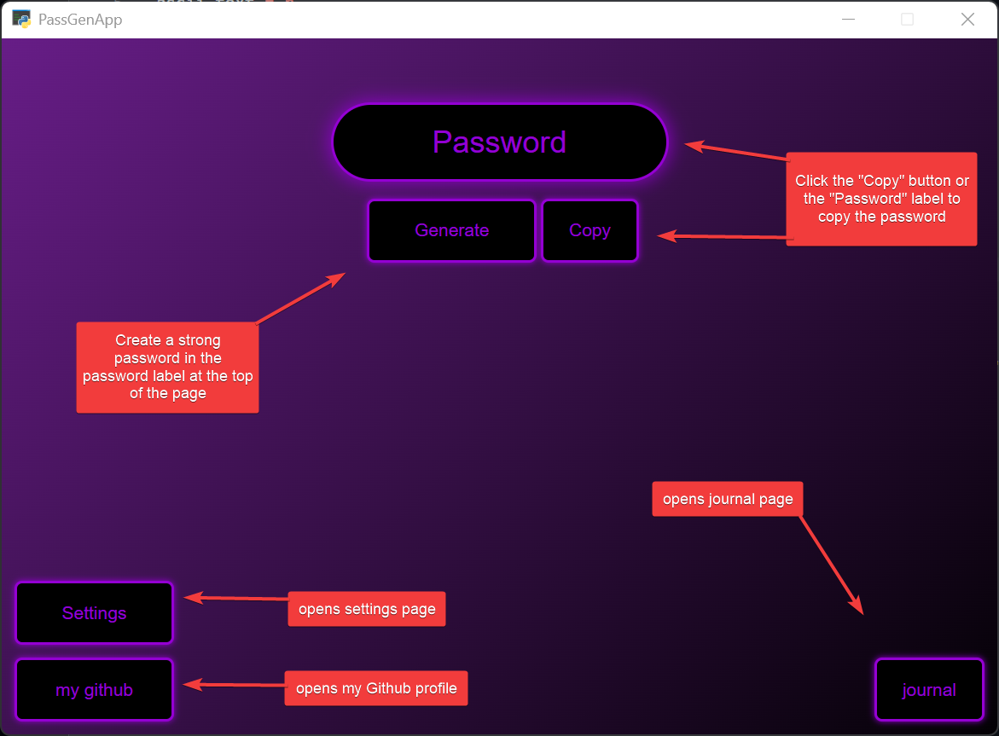
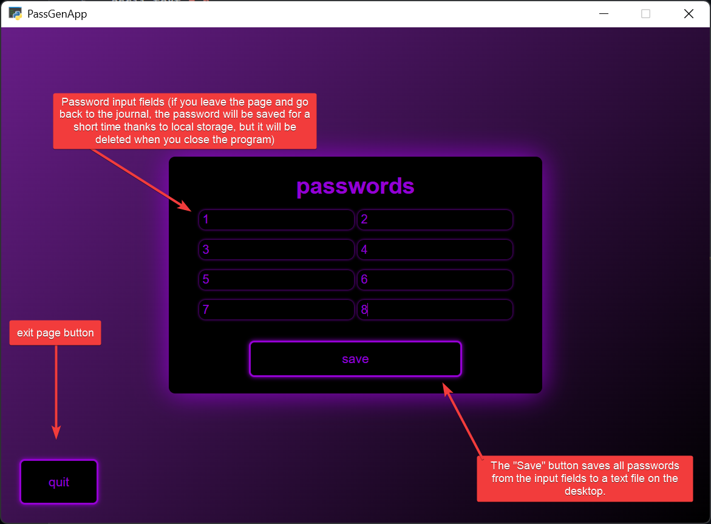
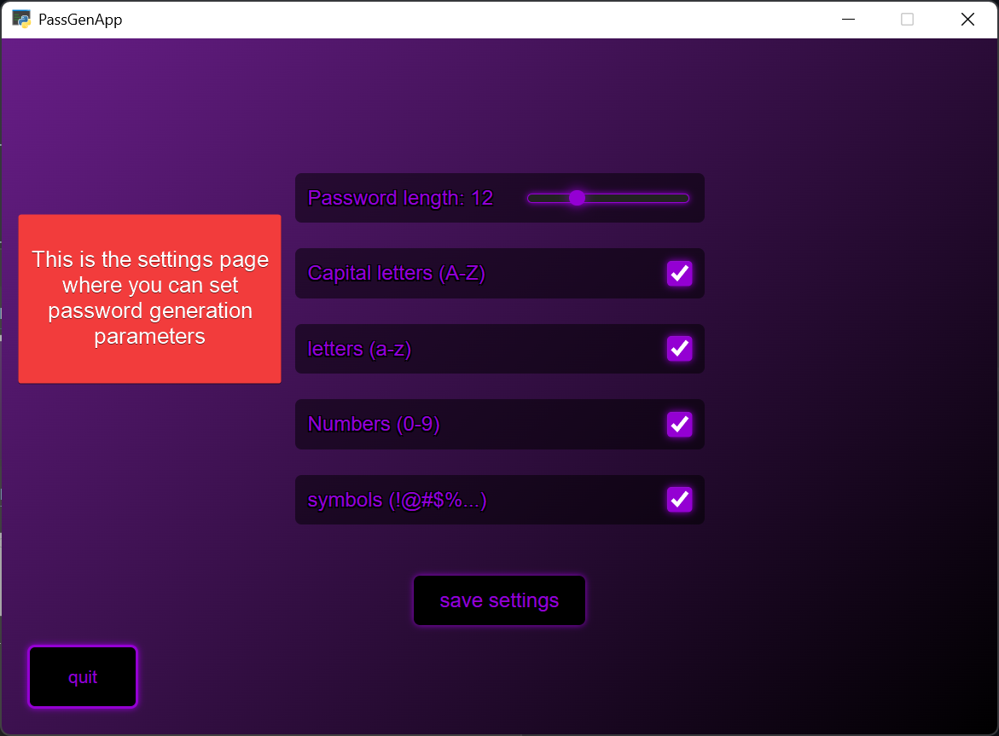
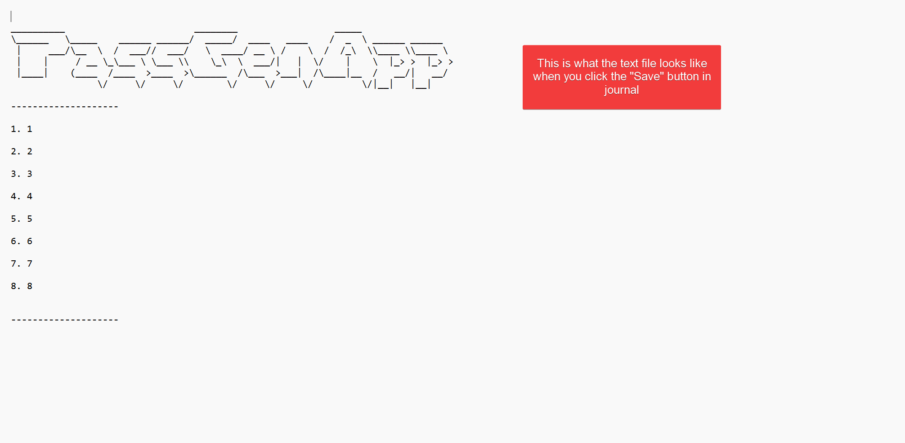

# 🌐 Web-Based Password Generator

A modern password generator with a sleek web interface (HTML/CSS/JS) and a powerful Python backend.

## 📸 img/Instructions
<div align="center">
  
  
  
  
</div>

## ✨ Key Features
- **Modern UI**: Clean and intuitive web interface.
- **Journal**: Track and manage your generated passwords.
- **Settings**: Customizable generation rules.
- **Cross-Platform**: Runs in your favorite browser via Python.

## 🛠️ Installation & Setup

1. **Clone the repository:**
   ```bash
   git clone https://github.com/niwobyte/PassGenApp.git
   cd PassGenApp
   pip install -r requirements.txt
   python PassGenApp.py
